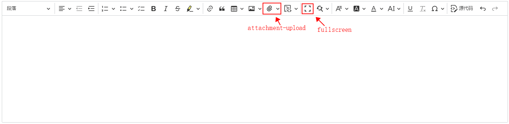

<p align='center'>
  
</p>

<p align='center'>
Ckeditor 5 with integrated <b>attachment upload</b> and <b>fullscreen</b>, based on <a href="https://ckeditor.com/docs/ckeditor5/latest/installation/getting-started/predefined-builds.html#classic-editor" target="_blank">classic-editor5</a>
</p>

<p align='center'>
<b>English</b> | <a href="https://github.com/hjwforever/ckeditor5-attachment/blob/main/README.zh-CN.md">简体中文</a>
<!-- Contributors: Thanks for getting interested, however, we DON'T accept new transitions to the README, thanks. -->
</p>

## Features

- Attachment Upload
- Fullscreen
- based on [classic-Ckeditor5](https://ckeditor.com/docs/ckeditor5/latest/installation/getting-started/predefined-builds.html#classic-editor)

## Use in Any Framework(React, Vue...)


```
import CustomEditor from 'ckeditor5-attachment'

```

[Integrating CKEditor 5 with JavaScript frameworks](https://ckeditor.com/docs/ckeditor5/latest/installation/getting-started/frameworks/overview.html)

[Ues in React](https://ckeditor.com/docs/ckeditor5/latest/installation/getting-started/frameworks/react.html)

[Use in Vue3](https://ckeditor.com/docs/ckeditor5/latest/installation/getting-started/frameworks/vuejs-v3.html) | [Use in Vue2](https://ckeditor.com/docs/ckeditor5/latest/installation/getting-started/frameworks/vuejs-v2.html)

[Use in Angular](https://ckeditor.com/docs/ckeditor5/latest/installation/getting-started/frameworks/angular.html)

and more...

## Just Use in HTML

use as the same as [classic-editor5-usage](https://ckeditor.com/docs/ckeditor5/latest/installation/getting-started/quick-start.html)

```
<script src="https://unpkg.com/browse/ckeditor5-attachment@1.0.5/build/ckeditor.js"></script>

<body>
  <h1>Classic editor</h1>
    <div id="editor">
        <p>This is some sample content.</p>
    </div>
    <script>
      CustomEditor
        .create( document.querySelector( '#editor' ) )
        .catch( error => {
            console.error( error );
          });
    </script>
</body>

```

## Build & Test

### Build

1. `pnpm i && pnpm build` install dependencies and build, The product editor is at`./build/ckeditor.js`
2. Start http service locally in the **root directory**, and Open the `sample/index.html` page in the browser to test the editor effect. For example `http-server.`
